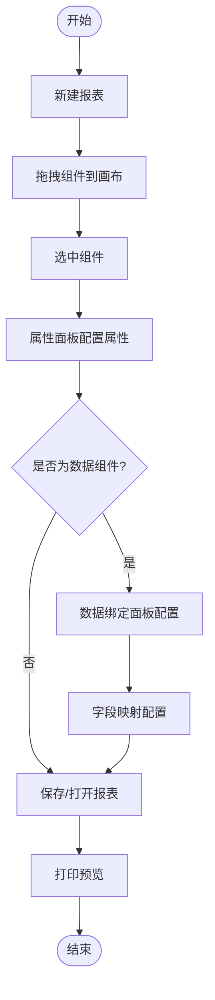
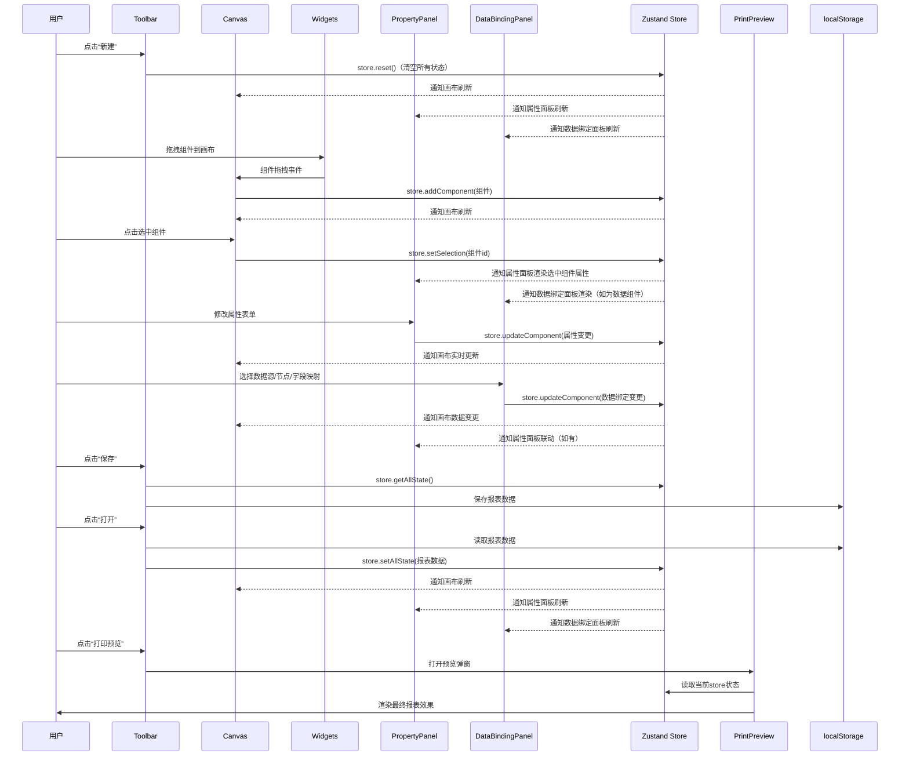

# React+Zustand 报表设计器项目详解（面试自述/文档模板）

## 一、项目背景与目标

本项目为一款**可视化报表设计器**，面向企业级数据报表场景，支持用户通过拖拽、配置、数据绑定等方式，快速生成个性化报表模板。  
**目标**：实现高可扩展、易维护、交互流畅的前端低代码报表设计平台。

---

## 二、技术栈与架构选型

- **前端框架**：React 18（函数组件+Hooks）
- **状态管理**：Zustand（按领域拆分 store，轻量高效）
- **UI 组件库**：Ant Design（表单、弹窗、表格、按钮等）
- **类型系统**：TypeScript（全量类型覆盖）
- **构建工具**：Vite（极速开发、按需打包）
- **其他**：ESLint/Prettier 规范、localStorage 持久化

---

## 三、项目目录与模块划分

```bash
components
├── report
│ └── ReportDesigner
│ ├── Designer.tsx  # 主组件，负责协调报表设计器的用户界面和逻辑
│ ├── componentRegistry.ts  # 组件注册表，用于管理组件定义和元数据
│ ├── components
│ │ ├── Canvas
│ │ │ ├── BatchToolbar.tsx  # 画布上批量操作的工具栏 (※)
│ │ │ ├── Canvas.tsx  # 核心画布组件，支持拖放和布局 (※※※※※)
│ │ │ ├── CanvasContent.tsx  # 渲染画布内的内容 (※※※※※)
│ │ │ ├── ComponentItem.tsx  # 表示画布上的单个组件  (※※※※※)
│ │ │ ├── Grid.tsx  # 画布上的网格系统，用于对齐和吸附 (※)
│ │ │ └── Ruler.tsx  # 标尺，用于精确测量和定位 (※)
│ │ ├── ComponentLibrary
│ │ │ └── index.tsx  # 用于选择和添加组件到画布的用户界面 (※)
│ │ ├── PrintPreview
│ │ │ └── index.tsx  # 预览报表打印效果的组件 (※※※)
│ │ ├── PrintPreviewModal
│ │ │ └── index.tsx  # 打印预览的模态对话框 (※)
│ │ ├── PropertyPanel
│ │ │ ├── BasePropertyPanel.tsx  # 属性编辑的基础组件 (※)
│ │ │ ├── DataBindingPanel.tsx  # 配置数据绑定的面板 (※※※※※)
│ │ │ ├── FieldRenderer.tsx  # 渲染单个属性字段  (※※※※※)
│ │ │ ├── StandardPropertyPanel.tsx  # 组件的标准属性面板  (※)
│ │ │ ├── getPropertyTabsConfig.tsx  # 配置属性面板的选项卡  (※)
│ │ │ ├── index.tsx  # 主属性面板组件  (※)
│ │ │ └── usePropertyChangeHandlers.ts  # 处理属性变化的自定义钩子 (※※※)
│ │ ├── Toolbar
│ │ │ └── index.tsx  # 报表设计器的主工具栏 (※※)
│ │ └── widgets
│ │ ├── ImageWidget.tsx  # 图片组件 (※※)
│ │ ├── LabelWidget.tsx  # 标签组件  (※※)
│ │ ├── QRCodeWidget.tsx  # 二维码组件  (※※)
│ │ ├── TableWidget.tsx  # 表格组件  (※※※※※)
│ │ └── index.ts  # 导出所有小部件  (※)
│ ├── hooks
│ │ ├── useBatchActions.ts  # 处理批量操作的自定义钩子  (※※※)
│ │ ├── useCanvasDnd.ts  # 画布拖放功能的自定义钩子  (※※※)
│ │ ├── useComponentMenu.ts  # 组件菜单的自定义钩子  (※※※)
│ │ └── useSelectionBox.ts  # 选择框功能的自定义钩子  (※※※)
│ ├── schemas
│ │ ├── baseSchema.ts  # 基础模式定义  (※)
│ │ ├── imageSchema.ts  # 图片组件的模式  (※)
│ │ ├── index.ts  # 导出所有模式  (※)
│ │ ├── labelSchema.ts  # 标签组件的模式  (※)
│ │ ├── qrcodeSchema.ts  # 二维码组件的模式  (※)
│ │ ├── schemaRegistry.ts  # 模式注册表  (※)
│ │ └── tableSchema.ts  # 表格组件的模式  (※)
│ ├── store
│ │ ├── canvasStore.ts  # 管理画布状态的存储 (※)
│ │ ├── componentsStore.ts  # 管理组件状态的存储 (※※※※※)
│ │ ├── dataSourceStore.ts  # 管理数据源的存储  (※)
│ │ ├── index.ts  # 导出所有存储  (※)
│ │ ├── mockData.ts  # 模拟数据用于测试  (※)
│ │ └── selectionStore.ts  # 管理选择状态的存储  (※)
│ ├── types
│ │ ├── component.ts  # 组件相关的类型定义  (※)
│ │ └── store.ts  # 存储相关的类型定义  (※)
│ └── utils
│ ├── align.ts  # 对齐相关的工具函数 (※※※)
│ ├── formatLabelValue.ts  # 格式化标签值的工具函数  (※※※)
│ ├── getJustifyContent.ts  # 获取对齐内容的工具函数  (※※※)
│ └── index.ts  # 导出所有工具函数
```

---

## 四、核心功能与流程详解

### 1. 组件体系与模块拆分

- **Toolbar（工具栏）**  
  - 新建、保存、打开、打印预览等操作入口
  - 画布尺寸、网格、标尺、吸附网格等配置
- **Canvas（画布）**  
  - 支持网格、标尺、吸附、缩放
  - 拖拽放置各类组件（表格、图片、标签、二维码等）
- **widgets（可拖拽组件）**  
  - 每种组件（如 ImageWidget、TableWidget、TextWidget）均为独立 React 组件，支持属性配置、数据绑定
- **PropertyPanel（属性面板）**  
  - 动态渲染选中组件的属性表单，支持联动、校验、格式化
- **DataBindingPanel（数据绑定面板）**  
  - 分步选择数据源、数据节点、字段映射，支持 Drawer 弹窗编辑字段映射关系
- **PrintPreview（打印预览）**  
  - 还原报表最终打印效果，支持分页、缩放

### 2. store 设计与数据流

- **componentsStore**：管理所有报表组件的结构与属性（增删改查、批量操作）
- **canvasStore**：管理画布尺寸、网格、标尺、吸附等全局配置
- **dataSourceStore**：管理所有数据源、数据节点、字段映射、示例数据
- **selectionStore**：管理当前选中组件、字段等 UI 状态
- **数据流原则**：所有组件均通过 zustand store 获取/更新数据，**杜绝 props 链式传递**，实现全局状态统一管理

### 3. 报表设计全流程

1. **新建报表**  
   - 工具栏点击“新建”，store 恢复初始状态，画布清空
2. **拖拽组件**  
   - 从左侧组件库拖拽表格、图片、标签等到画布
3. **属性配置**  
   - 选中组件，右侧属性面板动态渲染对应表单，支持实时修改
4. **数据绑定**  
   - 选中表格等数据组件，右侧数据绑定面板分步选择数据源、数据节点、字段映射
   - 字段映射支持 Drawer 弹窗批量编辑，所有字段选项来源于 dataSourceStore
5. **保存/打开报表**  
   - 工具栏“保存”支持多模板保存到 localStorage，支持命名、覆盖
   - “打开”可选择历史报表模板，自动恢复所有 store 状态
6. **打印预览**  
   - 工具栏“打印预览”弹窗，渲染最终报表效果，支持分页、缩放

### 4. 关键交互与细节

- **属性面板与画布联动**：属性变更实时反映到画布，选中切换自动刷新表单
- **字段映射配置**：支持字段拖拽排序、批量编辑、格式化、表达式、宽度、对齐、显示/隐藏等
- **右键菜单**：支持组件右键操作（如删除、复制、置顶/置底等）
- **防御性渲染**：空数据、无字段、无数据源等场景有友好提示
- **唯一性校验**：表格 rowKey、字段 key 等均有唯一性校验

---

## 五、技术难点与亮点

### 1. 复杂状态管理与解耦

- store 按领域拆分，组件间无 props 链式传递，所有状态变更均通过 actions，便于维护和扩展
- 属性面板、数据绑定面板、字段映射等复杂交互全部通过全局 store 实现联动

### 2. 动态表单与字段映射

- 属性面板、字段映射 Drawer 支持根据选中组件类型/数据节点动态渲染表单项
- 字段映射支持批量编辑、拖拽排序、格式化、表达式等高级功能

### 3. 高性能渲染

- 关键组件用 React.memo、useMemo、useCallback 避免不必要的渲染
- 表格、字段映射等大数据量场景下体验流畅

### 4. 工程化与规范

- TypeScript 全量类型覆盖，接口、store、组件 props 均有严格类型定义
- 统一 ESLint/Prettier 规范，代码风格一致
- 关键逻辑有单元测试，支持自动化构建和部署

### 5. 可扩展性与可维护性

- store 结构和组件设计为后续多用户协作、云端存储、权限、插件机制等预留了接口
- 代码易于二次开发和团队协作

---

## 六、工程化与团队协作

- **代码规范**：统一 ESLint/Prettier，TypeScript 类型校验，分支管理规范
- **文档完善**：README、接口文档、类型注释、核心流程说明
- **自动化**：支持一键启动、打包、测试，CI/CD 可扩展
- **测试**：Jest+RTL 单元测试，Cypress 集成测试，覆盖主流程和核心逻辑

---

## 七、可扩展性设计

- **多用户协作**：store 结构可扩展为多用户实时协作（如 socket/CRDT）
- **云端存储**：保存/打开接口可无缝切换为后端 API
- **权限与插件**：属性面板、数据绑定、字段映射等均可按需扩展为插件机制

---

## 八、项目总结与面试亮点

- 具备**复杂前端架构设计能力**，能独立主导中大型前端项目
- 精通 React 组件解耦、Zustand 状态管理、Ant Design 组件库最佳实践
- 熟悉 TypeScript 工程化、自动化测试、代码规范、团队协作
- 善于解决复杂交互、动态表单、数据驱动 UI 等高阶前端问题
- 具备良好的文档、注释、沟通能力，能带领团队持续优化项目

---

## 九、项目流程图/结构图（建议PPT或白板展示）

- 画出**模块结构图**（如：工具栏、画布、属性面板、数据绑定、store 关系）
- 画出**数据流动图**（如：组件操作→store→属性面板/画布联动）
- 画出**报表设计全流程图**（新建→拖拽→配置→数据绑定→保存/打开→预览）

---

好的，下面为你整理一份**适合面试自我介绍时口头表达的逐字稿**，内容涵盖项目背景、技术架构、主要模块、核心流程、技术亮点、难点突破、可扩展性等。你可以直接背诵或根据实际情况微调。

---

## 报表设计器项目介绍逐字稿

---

大家好，我想介绍一下我主导开发的一个前端项目——**React+Zustand 报表设计器**。

这个项目的目标是为企业级数据场景提供一个可视化、低代码的报表设计平台。用户可以通过拖拽、配置、数据绑定等方式，快速生成个性化的报表模板，极大提升了业务人员的自助报表能力。

### 技术架构方面

我们采用了**React 18**作为主框架，配合**Zustand**做全局状态管理，UI 组件库选用**Ant Design**，并且全程使用**TypeScript**保证类型安全。项目的工程化采用了**Vite**，实现了极速开发和按需打包。

### 项目结构和主要模块

整个项目采用了领域驱动的模块划分，主要包括：

- **工具栏（Toolbar）**：提供新建、保存、打开、打印预览等操作入口，同时支持画布尺寸、网格、标尺等全局配置。
- **画布（Canvas）**：支持网格、标尺、吸附、缩放等功能，用户可以在画布上拖拽放置各种组件，比如表格、图片、标签、二维码等。
- **组件库（widgets）**：每种可拖拽组件都是独立的 React 组件，支持属性配置和数据绑定。
- **属性面板（PropertyPanel）**：动态渲染选中组件的属性表单，支持实时联动和校验。
- **数据绑定面板（DataBindingPanel）**：分步选择数据源、数据节点和字段映射，支持 Drawer 弹窗批量编辑字段映射关系。
- **打印预览（PrintPreview）**：还原报表最终打印效果，支持分页和缩放。

### 状态管理与数据流

我们将全局状态按领域拆分为多个 store，比如 componentsStore、canvasStore、dataSourceStore、selectionStore 等。所有组件都通过 zustand store 获取和更新数据，彻底杜绝了 props 链式传递，实现了高效的组件解耦和状态同步。

### 报表设计的核心流程

用户可以通过以下流程完成报表设计：

1. 点击“新建”按钮，初始化画布和所有配置。
2. 从左侧组件库拖拽表格、图片等组件到画布。
3. 选中组件后，右侧属性面板会动态渲染对应的表单，支持实时修改属性。
4. 对于数据组件，可以通过数据绑定面板分步选择数据源、数据节点和字段映射，字段映射支持批量编辑和高级配置。
5. 设计完成后，可以通过“保存”功能将报表模板保存到本地，支持多模板管理和覆盖。
6. 通过“打开”功能可以随时切换和恢复历史报表模板。
7. 最后可以通过“打印预览”查看最终效果。

### 技术难点与亮点

- **复杂状态管理与解耦**：我们通过 zustand 按领域拆分 store，所有组件都只订阅自己关心的状态，极大提升了可维护性和扩展性。
- **动态表单与字段映射**：属性面板和字段映射 Drawer 都支持根据选中组件类型和数据节点动态渲染表单项，字段映射支持拖拽排序、批量编辑、格式化等高级功能。
- **高性能渲染**：关键组件都用到了 React.memo、useMemo、useCallback 等优化手段，保证了大数据量下的流畅体验。
- **工程化与规范**：项目全程使用 TypeScript，类型定义严格，统一了 ESLint/Prettier 规范，关键逻辑有单元测试，支持自动化构建和部署。
- **可扩展性**：store 结构和组件设计都为后续多用户协作、云端存储、权限、插件机制等预留了接口，便于二次开发和团队协作。

### 团队协作与工程实践

在团队协作方面，我们统一了代码规范和分支管理，完善了文档和注释，支持一键启动、打包和测试，保证了多人协作下的高效开发和代码质量。

### 项目收获

通过这个项目，我深入实践了 React 组件解耦、Zustand 状态管理、Ant Design 组件库的最佳实践，也积累了复杂交互、动态表单、数据驱动 UI、工程化等方面的丰富经验。

---

这就是我主导开发的报表设计器项目的整体介绍，谢谢！

---

## 一、项目模块关系图（架构图）

**描述：**

- 展示各大模块之间的依赖与调用关系，突出 store 的中心地位和各 UI 组件的分工。

**结构建议：**

```
+-------------------+         +-------------------+
|   Toolbar 工具栏   |<------->|   Canvas 画布      |
+-------------------+         +-------------------+
         |                             |
         v                             v
+-------------------+         +-------------------+
| PropertyPanel属性面板|<----->| widgets 组件库     |
+-------------------+         +-------------------+
         |                             |
         v                             v
+-------------------+         +-------------------+
|DataBindingPanel数据绑定|     | PrintPreview预览  |
+-------------------+         +-------------------+
         |                             |
         +-------------+---------------+
                       |
                       v
              +------------------+
              |   Zustand Store  |
              +------------------+
              | componentsStore  |
              | canvasStore      |
              | dataSourceStore  |
              | selectionStore   |
              +------------------+
```

**说明：**

- 所有 UI 组件都通过 store 读写数据，store 是唯一数据源。
- 组件间无 props 链式传递，联动全部靠 store。
- widgets 组件库可被 Canvas 拖拽，属性面板和数据绑定面板根据选中组件动态渲染。

---

## 二、核心流程图（报表设计主流程）



## 三、典型时序图（属性面板与画布联动）

**描述：涵盖从新建报表、拖拽组件、属性配置、数据绑定、保存/打开、预览等全链路，涉及主要前端模块与 store 的交互。**

- 用户（User）

- Toolbar（工具栏）

- Canvas（画布）

- Widgets（组件库/拖拽组件）

- PropertyPanel（属性面板）

- DataBindingPanel（数据绑定面板）

- Zustand Store（全局状态）

- PrintPreview（打印预览）

```
sequenceDiagram
    participant U as 用户
    participant T as Toolbar
    participant C as Canvas
    participant W as Widgets
    participant P as PropertyPanel
    participant D as DataBindingPanel
    participant S as Zustand Store
    participant V as PrintPreview

    %% 新建报表
    U->>T: 点击“新建”
    T->>S: store.reset()（清空所有状态）
    S-->>C: 通知画布刷新
    S-->>P: 通知属性面板刷新
    S-->>D: 通知数据绑定面板刷新

    %% 拖拽组件
    U->>W: 拖拽组件到画布
    W->>C: 组件拖拽事件
    C->>S: store.addComponent(组件)
    S-->>C: 通知画布刷新

    %% 选中组件
    U->>C: 点击选中组件
    C->>S: store.setSelection(组件id)
    S-->>P: 通知属性面板渲染选中组件属性
    S-->>D: 通知数据绑定面板渲染（如为数据组件）

    %% 属性配置
    U->>P: 修改属性表单
    P->>S: store.updateComponent(属性变更)
    S-->>C: 通知画布实时更新

    %% 数据绑定
    U->>D: 选择数据源/节点/字段映射
    D->>S: store.updateComponent(数据绑定变更)
    S-->>C: 通知画布数据变更
    S-->>P: 通知属性面板联动（如有）

    %% 保存报表
    U->>T: 点击“保存”
    T->>S: store.getAllState()
    T->>localStorage: 保存报表数据

    %% 打开报表
    U->>T: 点击“打开”
    T->>localStorage: 读取报表数据
    T->>S: store.setAllState(报表数据)
    S-->>C: 通知画布刷新
    S-->>P: 通知属性面板刷新
    S-->>D: 通知数据绑定面板刷新

    %% 打印预览
    U->>T: 点击“打印预览”
    T->>V: 打开预览弹窗
    V->>S: 读取当前store状态
    V->>U: 渲染最终报表效果
```

**Mermaid 代码：**



---

## 四、详细模块关系说明

- **Toolbar**：负责全局操作（新建、保存、打开、预览），通过调用 store 的 action 影响全局状态。
- **Canvas**：负责组件的可视化布局，监听 store 的组件树和画布配置，支持拖拽、缩放、吸附等。
- **widgets**：每个组件（如表格、图片、标签）独立，属性和数据均从 store 获取。
- **PropertyPanel**：根据当前 selectionStore 的选中项，动态渲染属性表单，表单变更直接 set 到 store。
- **DataBindingPanel**：专为数据组件服务，分步配置数据源、数据节点、字段映射，所有选项来源于 dataSourceStore。
- **PrintPreview**：只读 store 的当前状态，渲染最终报表效果。

---

## 五、画图建议

- **draw.io/ProcessOn**：用“流程图”“时序图”“组织结构图”模板，拖拽方块和箭头即可。
- **PPT**：用SmartArt或形状绘制，注意用不同颜色区分模块。
- **Mermaid**：可直接在 markdown 编辑器或 mermaid.live 画图。

---

非常明白！下面为你梳理**报表设计器“整体业务流程”的详细时序图**，涵盖从新建报表、拖拽组件、属性配置、数据绑定、保存/打开、预览等全链路，涉及主要前端模块与 store 的交互。  
你可以直接用 Mermaid、ProcessOn、draw.io 等工具绘制。

---

## 报表设计器整体流程时序图（详细版）

### 参与者

- 用户（User）
- Toolbar（工具栏）
- Canvas（画布）
- Widgets（组件库/拖拽组件）
- PropertyPanel（属性面板）
- DataBindingPanel（数据绑定面板）
- Zustand Store（全局状态）
- PrintPreview（打印预览）

---

### 说明

- **每一步都体现了用户操作、UI组件、store、数据持久化的完整链路。**
- **所有UI组件都只和store交互，store负责通知各模块刷新，实现解耦。**
- **保存/打开涉及localStorage（或后端API），可根据实际情况调整。**
- **打印预览只读store，不影响主流程。**

非常专业的准备！下面为你梳理**报表设计器项目**在面试中可能被问到的**30+高质量问题**，涵盖**整体架构、各模块实现、细节处理、状态管理、性能优化、工程化、可扩展性、代码实现**等多个维度，适合高级前端岗位。

---

## 一、项目总体与架构

---

### 1. 请简述你们报表设计器的整体架构设计思路？为什么这样拆分？

我们的报表设计器采用了**领域驱动的前端架构**，核心思路是将业务功能按领域（Domain）进行模块化拆分，每个模块只关注自身职责，所有全局状态通过 Zustand store 管理。  
主要模块包括：工具栏（Toolbar）、画布（Canvas）、组件库（widgets）、属性面板（PropertyPanel）、数据绑定面板（DataBindingPanel）、打印预览（PrintPreview）等。  
每个模块都只和全局 store 交互，**杜绝 props 链式传递**，实现了高内聚、低耦合。  
这样拆分的好处是：  

- 便于团队协作和代码维护，每个模块职责清晰；
- 支持功能的独立开发和测试，易于扩展和重构；
- store 作为唯一数据源，保证了数据一致性和联动性。

---

### 2. 为什么选择 Zustand 而不是 Redux/MobX/Context？它的优缺点是什么？

我们选择 Zustand 主要基于以下几点：

- **轻量易用**：Zustand API 简洁，无需繁琐的 action/reducer/dispatch，学习和维护成本低。
- **天然支持 hooks**：Zustand 完全基于 hooks，和现代 React 生态无缝衔接。
- **按需订阅**：组件可以选择性订阅 store 的任意片段，避免全量 re-render，性能优异。
- **无需 Provider**：Zustand 的 store 是全局的，不需要像 Context 那样层层包裹 Provider。
- **中间件丰富**：支持 devtools、persist、immer 等中间件，易于扩展。

与 Redux 相比，Zustand 更轻量、开发效率更高；与 MobX 相比，Zustand 更加可控、类型推导更好；与 Context 相比，Zustand 性能更优，适合中大型项目的全局状态管理。

**缺点**：Zustand 生态不如 Redux 丰富，部分极端场景下的时间旅行、插件体系不如 Redux，但对于本项目来说完全够用。

---

### 3. 如何保证组件间的解耦？store 拆分的原则是什么？

我们通过**领域拆分 store**和**只通过 store 通信**来保证组件间解耦。  
具体做法是：

- 每个业务领域（如组件树、画布配置、数据源、选中项）都单独一个 store 文件，store 只管理本领域的状态和 actions。
- 组件只通过 hooks 订阅自己关心的 store 片段，绝不跨层 props 传递。
- 组件间的联动全部通过 store 状态变更和 selector 实现，避免直接引用或回调。

**store 拆分原则**：

- 单一职责：每个 store 只负责一个领域的状态和操作。
- 高内聚低耦合：store 之间不直接依赖，必要时通过 selector 组合。
- 可扩展性：为后续新业务（如权限、协作、插件）预留扩展点。

---

### 4. 如何实现“属性面板-画布-数据绑定面板”三者的联动？

三者的联动全部通过**Zustand store**实现：

- 选中组件时，selectionStore 记录当前选中项，属性面板和数据绑定面板都通过 selectionStore 获取当前组件 id。
- 属性面板和数据绑定面板分别订阅 componentsStore 和 dataSourceStore，动态渲染对应表单和数据绑定选项。
- 属性面板/数据绑定面板的表单变更会直接 set 到 componentsStore，画布组件订阅 componentsStore，实时反映属性变化。
- 任何一方变更，store 状态同步，所有订阅方自动刷新，实现了“单向数据流+全局联动”。

---

### 5. 你们的项目如何支持多报表模板的保存与打开？数据持久化方案是什么？

我们通过**localStorage**实现多报表模板的保存与打开：

- 保存时，将当前 store 的所有关键状态（components、canvasConfig、dataSources 等）序列化为一个对象，存入 localStorage 的报表列表（支持命名、覆盖）。
- 打开时，从 localStorage 读取指定模板的数据，恢复到各个 store，实现报表的完整还原。
- 这种方案简单高效，适合本地开发和小型应用。后续如需云端存储，只需将保存/读取逻辑切换为 API 调用即可，无需改动主流程。

---

### 6. 如何保证项目的可扩展性？如果要支持插件、权限、协作，如何设计？

可扩展性体现在以下几个方面：

- **store 结构**：所有状态都按领域拆分，便于后续新增 store（如权限、协作、插件等）。
- **组件解耦**：所有 UI 组件只依赖 store，不直接依赖彼此，便于插拔和扩展。
- **类型定义**：所有数据结构、store、props 都有严格的 TypeScript 类型，便于扩展和重构。
- **插件机制**：可通过动态注册组件、属性表单、数据绑定面板等方式支持插件扩展。
- **权限/协作**：可为 store 增加用户、角色、协作状态，所有操作通过 action 校验权限，协作可用 socket/CRDT 实现实时同步。

---

### 7. 如何实现“新建”报表时所有状态的初始化和清空？

“新建”操作时，工具栏会调用各个 store 的 reset/set 方法，将所有状态恢复为初始值：

- componentsStore.setComponents([]) 清空组件树
- canvasStore.setCanvasConfig(defaultConfig) 恢复画布配置
- dataSourceStore.setDataSources(initialDataSources) 恢复数据源
- selectionStore.setSelectedIds([]) 清空选中项
  这样所有模块都回到初始状态，画布、属性面板、数据绑定面板等 UI 自动刷新，用户获得一个全新的空白报表设计环境。

---

## 二、各模块实现与细节

### 1. Canvas 画布如何实现网格、标尺、吸附、缩放等功能？

- **网格**：通过在 Canvas 组件内渲染一组等间距的横纵线（SVG 或 div），间距由 store（如 gridSize）控制。切换开关时，store 状态变更，Canvas 重新渲染。
- **标尺**：在画布顶部和左侧渲染标尺刻度（可用 SVG 或绝对定位的 div），刻度单位和显示与 store 配置（如 showRuler, rulerUnit）联动。
- **吸附**：拖拽组件时，计算其坐标与最近网格线的距离，若小于阈值则自动对齐到网格线（吸附），吸附开关由 store 控制。
- **缩放**：通过 CSS transform: scale 或设置画布容器的缩放比例，store 记录当前缩放比例，所有坐标、尺寸计算都基于缩放后数值。

### 2. 组件拖拽到画布的实现原理是什么？如何保证拖拽流畅和数据同步？

- **实现原理**：左侧 widgets 组件库每个组件支持拖拽（dnd-kit），Canvas 作为 drop 区，监听 onDrop 事件。
- **拖拽流畅**：拖拽时只渲染拖影，不操作真实 DOM，落下时才在 store 中 addComponent，Canvas 监听 store 自动刷新。
- **数据同步**：拖拽落下时生成唯一 id、初始坐标、类型等，写入 componentsStore，属性面板、画布等订阅 store，自动同步 UI。
- **优化**：拖拽过程不频繁 setState，避免卡顿；吸附、边界检测等逻辑只在 drop 或 mouseup 时处理。

---

### 3. 属性面板如何做到根据选中组件类型动态渲染表单？

- **选中组件**：selectionStore 记录当前选中组件 id，属性面板通过 hooks 订阅。
- **动态渲染**：属性面板根据选中组件的 type，从组件注册表（如 componentRegistry）获取对应的属性 schema 或表单配置，动态渲染不同的表单项。
- **表单联动**：表单项的值和校验规则都来源于组件的 props 类型定义，变更时直接 set 到 componentsStore，画布和其他面板自动联动。
- **可扩展**：新增组件类型时只需注册新的属性 schema，无需改动属性面板主逻辑。

---

### 4. 数据绑定面板的分步联动是如何实现的？字段映射 Drawer 的数据来源和交互细节？

- **分步联动**：数据绑定面板分为“选择数据源”→“选择数据节点”→“字段映射”三步。每一步的下拉选项都来源于 dataSourceStore，前一步未选时后一步不可用。
- **字段映射 Drawer**：点击“字段映射”按钮弹出 Drawer，内部渲染字段列表（如 columns），每一项可编辑列名、格式化、宽度、对齐、是否显示等。
- **数据来源**：所有字段选项都来源于 dataSourceStore 的 dataNodeFields，保证和数据源配置一致。
- **交互细节**：支持字段拖拽排序、批量编辑、校验、表达式等，变更后直接写入 componentsStore，画布和属性面板自动联动。

---

### 5. 如何保证字段映射的唯一性、顺序、批量编辑等高级功能？

- **唯一性**：每个字段（如表格列）都有唯一 key（如 dataIndex），新增/编辑时校验 key 是否重复，防止冲突。
- **顺序**：字段列表支持拖拽排序（如 react-sortable-hoc），排序结果实时写入 store，画布和表单自动刷新。
- **批量编辑**：Drawer 内可支持多选字段批量设置属性（如对齐、宽度、显示/隐藏），批量操作通过 store 的 batchUpdate actions 实现。
- **防御性渲染**：字段为空、重复、非法时有 UI 提示和校验，防止脏数据写入。

---

### 6. 如何实现右键菜单、快捷操作（如复制、删除、置顶/置底）？

- **右键菜单**：Canvas 组件监听 onContextMenu 事件，弹出自定义菜单（如 antd Dropdown），菜单项包括复制、删除、置顶/置底等。
- **快捷操作**：菜单项点击后调用 componentsStore 的对应 action（如 copyComponent、removeComponent、moveComponentZIndex），store 状态变更后画布和属性面板自动刷新。
- **多选支持**：支持批量操作时，selectionStore 记录多个选中项，批量 action 统一处理。

---

### 7. 如何防止空数据、无字段、无数据源等场景下的渲染异常？

- **空态渲染**：所有组件、面板、表单都加了空态判断（如无数据源、无字段、无选中项时显示提示或占位符）。
- **防御性代码**：渲染前判断数据合法性，避免 undefined/null 传递到子组件或表单。
- **UI 友好提示**：如“请选择数据源”“暂无字段”“未选中组件”等，提升用户体验。
- **类型安全**：TypeScript 类型定义保证数据结构完整，减少运行时异常。

---

### 8. 打印预览如何还原最终报表效果？分页、缩放是如何处理的？

- **还原效果**：PrintPreview 组件只读当前 store 的所有状态（组件树、画布配置、数据源等），用和画布一致的渲染逻辑还原最终报表。
- **分页**：根据画布尺寸和内容自动分页（如每页高度固定，超出自动分页），分页逻辑可用 CSS 分页或手动拆分 DOM。
- **缩放**：支持用户调整预览缩放比例（如 50%、100%、200%），通过 CSS transform: scale 实现，保证预览和实际打印一致。
- **只读模式**：预览时所有组件不可编辑，避免误操作。

---

## 三、状态管理与数据流

### 1. Zustand store 如何按领域拆分？每个 store 的职责是什么？

**领域拆分原则**：  
我们将全局状态按业务领域（Domain）进行拆分，每个 store 只负责一个领域的状态和操作，互不干扰，便于维护和扩展。

**具体拆分：**

- `componentsStore`：管理所有报表组件（如表格、图片、标签等）的结构、属性、增删改查、批量操作等。
- `canvasStore`：管理画布的全局配置（如尺寸、网格、标尺、缩放、吸附等）。
- `dataSourceStore`：管理所有数据源、数据节点、字段映射、示例数据等。
- `selectionStore`：管理当前选中组件、字段等 UI 状态，支持多选。
- 其他如 `userStore`、`permissionStore` 可按需扩展。

**好处**：  

- 单一职责，易于维护和测试。
- 便于多人协作和功能扩展。
- store 之间无强依赖，组合灵活。

---

### 2. 组件如何只订阅自己关心的 store 状态？如何避免全量 re-render？

**Zustand 的优势**：  
Zustand 支持**选择性订阅**，即组件可以通过 selector 只订阅 store 的某一片段。

**实现方式：**

```ts
const selectedComponent = useComponentsStore(s => s.components.find(c => c.id === id));
```

- 组件只会在 `selectedComponent` 变化时重新渲染，其他无关状态变化不会影响。
- 可以用 `shallow` 比较进一步减少不必要的渲染。

**避免全量 re-render 的措施：**

- store 拆分，减少单个 store 的状态体积。
- 组件只用 selector 取关心的数据，不直接 use 整个 store。
- 关键组件用 `React.memo`、`useMemo`、`useCallback` 做缓存。

---

### 3. store 的类型定义如何保证类型安全？如何防止 any？

**TypeScript 全量类型覆盖**：

- 每个 store 的 state、actions、selector 都有明确的接口或类型定义。
- 组件 props、store 返回值、action 参数都用类型约束，禁止 any。
- 复杂数据结构（如组件属性、字段映射）单独定义类型（如 `ReportComponent`、`DataSource`、`FieldMapping` 等）。

**举例：**

```ts
interface ComponentsState {
  components: ReportComponent[];
  setComponents: (components: ReportComponent[]) => void;
  // ...
}
```

- 使用 TypeScript 的类型推导和泛型，保证所有数据流类型安全。
- 配合 ESLint/TSLint 禁止 any，强制类型检查。

---

### 4. store 的 actions 如何设计？如何保证单一职责和可测试性？

**设计原则**：

- 每个 action 只做一件事（如 addComponent、updateComponent、removeComponent、setCanvasConfig 等）。
- action 命名清晰，参数类型明确，副作用最小。
- 批量操作用 batchXXX 统一处理，避免重复代码。

**可测试性**：

- action 逻辑尽量纯粹，便于单元测试。
- 复杂逻辑可抽离为独立函数，action 只做状态变更。
- 通过 mock store，直接调用 action 并断言状态变化。

**举例：**

```ts
const useComponentsStore = create<ComponentsState>()(
  immer((set) => ({
    components: [],
    addComponent: (comp) => set(state => { state.components.push(comp); }),
    updateComponent: (id, data) => set(state => {
      const idx = state.components.findIndex(c => c.id === id);
      if (idx !== -1) Object.assign(state.components[idx], data);
    }),
    // ...
  }))
);
```

---

### 5. 如何实现属性面板、数据绑定面板、画布的“单向数据流”？

**单向数据流实现**：

- 用户操作（如表单输入、下拉选择）只会通过 action 修改 store 状态。
- store 状态变更后，所有订阅该状态的组件（如属性面板、画布、数据绑定面板）自动刷新 UI。
- 组件之间**不直接通信**，所有联动都通过 store 实现，保证了数据流的单向性和可追踪性。

**流程举例**：

1. 用户在属性面板修改属性 → 触发 store.updateComponent
2. store 状态变化 → 画布组件订阅到变化，自动重新渲染
3. 数据绑定面板如有依赖，也会自动刷新

**好处**：

- 数据流清晰，易于追踪和调试
- 组件解耦，便于维护和扩展
- 状态一致性强，避免“脏数据”或 UI 不同步

---

## 四、性能优化与工程化

### 1. 哪些地方用到了 React.memo/useMemo/useCallback？为什么？

**使用场景：**

- **React.memo**：用于包裹画布上的组件（如表格、图片、标签等），防止无关属性变化导致的重复渲染。例如，只有当组件自身的 props 发生变化时才重新渲染，提升画布性能。
- **useMemo**：用于缓存计算量较大的派生数据，如属性面板/数据绑定面板中根据选中组件类型动态生成的表单 schema、字段映射列表等，避免每次渲染都重复计算。
- **useCallback**：用于缓存事件处理函数（如 onChange、onClick），防止因父组件渲染导致子组件 props 变化，进而引发不必要的子组件重渲染，尤其在传递给深层组件或依赖于依赖项的回调时。

**目的：**

- 降低不必要的渲染次数，提升大数据量和复杂交互下的性能。
- 保证组件只在真正需要时才更新，提升用户体验。

---

### 2. 如何优化大数据量下的表格、字段映射渲染性能？

**优化措施：**

- **虚拟滚动/虚拟化**：对于大表格或字段映射列表，采用虚拟滚动（如 antd Table 的 scroll/virtual、react-window、react-virtualized），只渲染可视区域的数据，大幅减少 DOM 节点数量。
- **分片渲染**：如字段映射 Drawer 内字段过多时，分批渲染或分页，避免一次性渲染全部。
- **选择性订阅 store**：表格/字段映射组件只订阅自己关心的数据片段，避免全量 re-render。
- **React.memo/useMemo**：对每一行/每一字段项用 React.memo 包裹，props 不变时不重新渲染。
- **事件防抖/节流**：如批量编辑、拖拽排序等操作，采用防抖/节流，减少高频操作带来的性能压力。

---

### 3. 如何做代码分割、按需加载？Vite 的优势体现在哪里？

**代码分割与按需加载：**

- **路由级分割**：如 PrintPreview、字段映射 Drawer 等非主流程页面，采用 React.lazy + Suspense 动态加载，减少首屏包体积。
- **组件级分割**：对大体积、低频使用的组件（如复杂表单、图表、预览等）用动态 import 实现懒加载。
- **Antd 按需加载**：通过 babel-plugin-import 或 Vite 插件，实现 antd 组件和样式的按需引入，避免全量打包。

**Vite 的优势：**

- **极速冷启动**：Vite 利用原生 ES 模块，开发环境无需打包，启动极快。
- **高效 HMR**：模块热更新速度极快，提升开发效率。
- **自动代码分割**：生产环境自动做 chunk 拆分，按需加载。
- **内置优化**：支持 tree-shaking、压缩、预构建等，最终包体积更小。

---

### 4. 如何保证属性面板、数据绑定面板、字段映射等表单的可配置和可扩展？

**实现方式：**

- **表单 schema 驱动**：属性面板、数据绑定面板、字段映射等表单均采用 schema 配置（如 JSON Schema 或自定义 schema），每种组件类型/数据节点对应一份 schema，渲染时动态生成表单项。
- **组件注册表**：每种可拖拽组件（如表格、图片、标签）在注册时声明自己的属性 schema、数据绑定 schema，属性面板/数据绑定面板根据选中组件类型自动加载对应 schema。
- **表单项可扩展**：支持自定义表单项类型（如表达式、格式化、拖拽排序等），新增表单项只需扩展 schema 和渲染组件，无需改动主流程。
- **字段映射配置**：字段映射 Drawer 支持批量编辑、拖拽排序、批量操作等，所有配置项都来源于 schema，可灵活扩展。
- **插件机制预留**：表单渲染逻辑支持插件注册，后续可通过插件扩展更多表单项或交互能力。

**好处：**

- 新增/修改组件类型、数据绑定类型、字段映射类型时，只需扩展 schema 和注册表，无需大改主流程代码，极大提升了可扩展性和可维护性。

---

## 六、代码实现与常见陷阱

### 1. 请写一个 useZustandStore 的自定义 hook，要求类型安全且支持选择性订阅。

```ts
// 假设有如下 store
import { create } from "zustand";

interface MyState {
  count: number;
  user: { name: string; age: number };
  setCount: (c: number) => void;
}

export const useMyStore = create<MyState>((set) => ({
  count: 0,
  user: { name: "张三", age: 18 },
  setCount: (c) => set({ count: c }),
}));

// 通用的类型安全选择性订阅 hook
import { useCallback } from "react";
import { EqualityChecker, StateSelector } from "zustand";

export function useZustandStore<T, S>(
  storeHook: () => T,
  selector: StateSelector<T, S>,
  equalityFn?: EqualityChecker<S>
): S {
  // 直接用 zustand 的 selector 机制
  return storeHook()(selector, equalityFn);
}

// 用法举例
const count = useZustandStore(useMyStore, s => s.count);
const userName = useZustandStore(useMyStore, s => s.user.name);
```

**说明**：这样组件只会在自己关心的状态变化时更新，类型推导完整。

---

### 2. 如何防止 props 链式传递？举例说明。

**做法**：  

- 所有全局/跨层级状态都放到 zustand store，组件通过 hook 直接获取，不通过 props 层层传递。
- 只在局部状态（如表单输入、弹窗开关）用 useState。

**举例**：  
错误做法（props 链式传递）：

```tsx
<Parent>
  <ChildA data={data}>
    <ChildB data={data}>
      <ChildC data={data} />
    </ChildB>
  </ChildA>
</Parent>
```

正确做法（store 直取）：

```tsx
// 在 ChildC 内部
const data = useMyStore(s => s.data);
```

这样 ChildC 只关心 data，Parent/ChildA/ChildB 无需感知。

---

### 3. 如何实现字段映射的拖拽排序？代码层面如何处理？

- 字段映射 Drawer 内部用如 `react-sortable-hoc`、`react-beautiful-dnd` 等库包裹字段列表。
- 拖拽结束时，获取新的字段顺序，调用 store 的 batchUpdate 或 setColumns 方法，更新字段顺序。

**代码片段：**

```tsx
import { DragDropContext, Droppable, Draggable } from "react-beautiful-dnd";

function onDragEnd(result) {
  if (!result.destination) return;
  const newColumns = reorder(columns, result.source.index, result.destination.index);
  setColumns(newColumns); // 写入 store
}
```

**核心**：顺序变化只影响 columns 数组的顺序，store 变更后 UI 自动刷新。

---

### 4. 如何实现报表模板的导入导出？涉及哪些数据结构？

- **导出**：将当前 store 的所有关键状态（如 components、canvasConfig、dataSources 等）序列化为 JSON 字符串，提供下载（如 Blob+URL.createObjectURL）。
- **导入**：用户上传 JSON 文件，解析后校验数据结构，写入各个 store，恢复报表状态。

**数据结构**：

```ts
interface ReportTemplate {
  components: ReportComponent[];
  canvasConfig: CanvasConfig;
  dataSources: DataSource[];
  // ...其他需要持久化的状态
}
```

**代码片段**：

```ts
// 导出
const data: ReportTemplate = { ... };
const blob = new Blob([JSON.stringify(data)], { type: "application/json" });
const url = URL.createObjectURL(blob);
// 提供下载链接

// 导入
const file = ...; // 用户上传
const reader = new FileReader();
reader.onload = e => {
  const data = JSON.parse(e.target.result as string);
  // 校验并写入 store
};
```

---

### 5. 如何处理图片/表格等组件的自适应、缩放、边界检测？

- **自适应/缩放**：组件宽高用百分比或响应式单位，画布缩放时用 CSS transform: scale，组件内部用 object-fit、overflow 控制内容自适应。
- **边界检测**：拖拽/缩放组件时，判断新坐标/尺寸是否超出画布边界，超出则自动吸附到边界或禁止超出。
- **实现**：在拖拽/缩放事件中，实时计算并修正 left/top/width/height，保证组件始终在画布内。

---

### 6. 如何保证组件的唯一 key？rowKey 冲突如何防御？

- **唯一 key**：每个组件/表格行都生成全局唯一 id（如 uuid、时间戳+自增），作为 key 或 rowKey。
- **防御冲突**：新增/导入组件时，校验 id 是否已存在，若冲突则重新生成。
- **表格 rowKey**：如 rowKey 由数据字段决定，需保证该字段在数据源内唯一，若检测到重复则给出 UI 警告或自动修正。

---

### 7. 如何实现属性面板的表单校验和格式化？

- **校验**：属性 schema 中声明每个字段的校验规则（如 required、pattern、min/max），表单渲染时自动应用（如 antd Form 的 rules）。
- **格式化**：输入/输出时用 formatter/parse 函数处理（如数字、日期、表达式等），保证数据一致性。
- **实现**：表单 onChange 时先格式化再 set 到 store，提交/失焦时做校验，校验不通过时给出 UI 提示。

---

### 8. 如何处理异步数据源、接口异常、网络错误等场景？

- **异步加载**：数据源配置支持 url，store 提供 fetchDataSource 方法，异步拉取数据。
- **异常处理**：用 try/catch 捕获接口异常，store 记录 loading/error 状态，UI 层根据状态渲染 loading/错误提示。
- **重试/兜底**：接口失败时可提供重试按钮，或回退到本地 mock 数据。

---

### 9. 如何实现 Undo/Redo（撤销/重做）功能？store 需要做哪些调整？

- **实现思路**：store 维护一个历史快照栈（undoStack/redoStack），每次状态变更时 push 当前快照。
- **撤销**：undo 时 pop undoStack，恢复上一个快照到 store。
- **重做**：redo 时 pop redoStack，恢复下一个快照。
- **store 调整**：所有关键状态变更都要能序列化为快照，且变更操作要统一通过 action 触发，便于捕捉和回滚。

---

### 10. 如何做字段映射的批量操作和防御性渲染？

- **批量操作**：字段映射 Drawer 支持多选字段，批量设置属性（如对齐、宽度、显示/隐藏），通过 store 的 batchUpdate actions 实现。
- **防御性渲染**：渲染前判断字段列表是否为空、key 是否唯一、数据是否合法，异常时显示友好提示或占位符，防止渲染崩溃。

---
